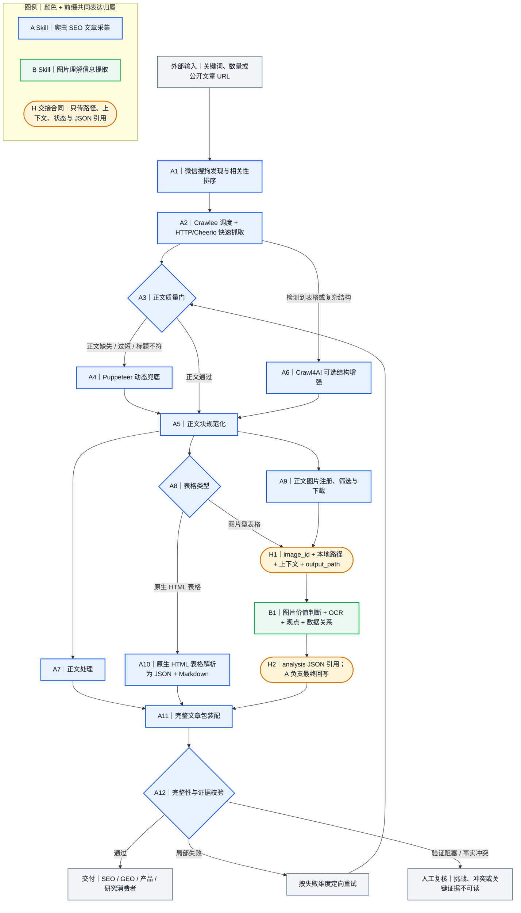

# WeChat Multimodal Research Crawler for Codex

[](https://github.com/zykzyk888/wechat-multimodal-research-crawler-for-codex-skills/actions/workflows/ci.yml)
[](LICENSE)
[](package.json)
[](#方式一直接安装到-codex推荐)

面向 Codex 的微信公开搜索与多模态研究工具：把关键词或公开文章链接转化为包含**有序正文、原生表格、正文图片、图片知识和来源证据**的研究资料包。

Four quality-gated routes—HTTP + Cheerio, Crawlee, Puppeteer, and optional Crawl4AI—capture public WeChat article evidence. A separate Codex image-understanding Skill extracts OCR, claims, data points, and visual relationships into validated JSON.

> 独立社区项目，非 OpenAI、腾讯、微信、搜狗、Apify 或其他依赖项目的官方产品或背书项目。

## 为什么做这个项目

传统“文章爬虫”常常只交付一段纯文本，但微信公众号的关键事实可能藏在：

- 产品截图与操作界面；
- 图表、图片表格、流程图和信息图；
- 原生 HTML 表格的行列关系；
- 正文图片在文章中的位置和上下文；
- 某次抓取到底通过、失败、降级还是仍待复核的证据。

本项目把这些维度装配成可验证的文章包，让 SEO、GEO、产品、市场和技术研究 Agent 能继续消费，而不是重新猜测网页结构。

## 核心能力

| 能力 | 结果 |
|---|---|
| 微信公开搜索 | 按关键词读取公开搜狗微信结果，保留观察位置并做相关性排序、解析和去重 |
| 四路高可用采集 | HTTP + Cheerio 快速路径、Crawlee 批次调度、Puppeteer 定向兜底、Crawl4AI 可选结构增强 |
| 正文完整性 | 保存原始 HTML 证据、有序正文 blocks 和可读 Markdown |
| 表格完整性 | 原生数据表同时保存 JSON/Markdown、表头/单元格/span；布局表计数并过滤 |
| 图片完整性 | 注册、去重、下载正文图片，保留文章位置、上下文、哈希和来源 |
| 图片知识提取 | Codex 视觉检查、OCR、观点、数据点、关系、证据、置信度和不确定项 |
| 质量与失败隔离 | 每篇、每个维度独立状态；只重试失败部分，不因单篇或浏览器失败中止整个批次 |
| Codex 原生调用 | 三个可单独安装的 Skill，也可由资料采集 Role 端到端串联 |

## 一分钟上手

### 方式一：直接安装到 Codex（推荐）

在 Codex 中发送：

```text
使用 $skill-installer 从 GitHub 仓库 zykzyk888/wechat-multimodal-research-crawler-for-codex-skills 安装以下三个路径：
skills/sp-role-pachong-ziliao-sousuo-caiji-expert
skills/sp-pachong-seo-wenzhang-caiji
skills/sp-tupian-lijie-xinxi-tiqu
```

也可以按需只安装一个原子 Skill。安装后新开一个 Codex 任务，让 Skill 元数据重新加载。

首次使用爬虫 Skill 时，Codex 会在该 Skill 的 `scripts` 目录执行锁文件安装：

```bash
npm ci
```

然后直接用自然语言：

```text
搜索 SEO 和 GEO 两个主题，各筛选 7 篇高相关微信公众号文章。
保存完整正文、原生表格和正文图片；分析有信息价值的图片；
最后交付 14 个可验证文章包、质量矩阵和失败项。
```

### 方式二：本地 CLI

```bash
git clone https://github.com/zykzyk888/wechat-multimodal-research-crawler-for-codex-skills.git
cd wechat-multimodal-research-crawler-for-codex-skills
npm run setup
npm test
node bin/research-harvester.mjs --help
```

Windows PowerShell 如果执行策略拦截 `npm.ps1`，将 `npm` 替换为 `npm.cmd`。

先发现公开候选：

```bash
node bin/research-harvester.mjs discover \
  --topics SEO,GEO \
  --top-k 7 \
  --pages 3 \
  --output ./runs/seo-geo
```

再执行默认质量级联：

```bash
node bin/research-harvester.mjs capture \
  --input ./runs/seo-geo/sources.json \
  --output ./runs/seo-geo \
  --engine auto
```

PowerShell 可将多行命令写成一行。`runs/` 默认不会进入 Git。

图片文件下载后，调用 `$sp-tupian-lijie-xinxi-tiqu` 读取每个文章包的 `vision-jobs.json`，写入图片分析 JSON；最后执行：

```bash
node bin/research-harvester.mjs finalize --input ./runs/seo-geo/article-package/01
node bin/research-harvester.mjs validate --input ./runs/seo-geo/article-package/01
```

完整步骤见 [快速上手](docs/quickstart.md)，常见失败见 [故障排查](docs/troubleshooting.md)。

## Windows、macOS 与 Linux

不需要为苹果电脑维护另一套仓库或 Skill：同一份 Node.js 代码支持 Windows、macOS 和 Linux，并自动发现各平台已安装的 Chrome。GitHub Actions 分别在 Windows x64、macOS Apple Silicon、macOS Intel 和 Ubuntu x64 运行锁文件安装、离线功能、Skill、完整 Git 历史脱敏和浏览器路径验证。

这是 Codex/CLI 的**桌面配套工具**，不是 iPhone/iPad App；iOS/iPadOS 不能在本地执行这套 Node + Chrome 流程。命令差异、Chrome 路径和证据边界见 [平台支持矩阵](docs/platform-support.md)。

## 三个 Codex Skills

| Skill | 定位 | 唯一写入边界 |
|---|---|---|
| [`sp-role-pachong-ziliao-sousuo-caiji-expert`](skills/sp-role-pachong-ziliao-sousuo-caiji-expert/SKILL.md) | 研究资料采集负责人：锁定主题/数量、调度、验收、重试和交付 | run contract、batch ledger、delivery manifest |
| [`sp-pachong-seo-wenzhang-caiji`](skills/sp-pachong-seo-wenzhang-caiji/SKILL.md) | 搜索与多模态文章采集原子能力 | 正文、表格、图片文件、文章包、最终引用与状态 |
| [`sp-tupian-lijie-xinxi-tiqu`](skills/sp-tupian-lijie-xinxi-tiqu/SKILL.md) | 图片理解与视觉信息提取原子能力 | 每张图片的 analysis JSON |

普通批次直接调用 Role；已经有公开 URL 时可以单独调用爬虫；已经有本地图片时可以单独调用图片理解。

## 四路不是“四倍重复抓取”

四路是同一篇文章包合同下的**分层调度与定向兜底**：默认先走低成本路径，只有未通过同一质量门的维度才升级或增强。下面的大图直接标明两个原子 Skill 的责任和交接合同。

<!-- two-skill-flow:start -->



<!-- two-skill-flow:end -->

- Crawlee 是默认批次运行外壳。
- HTTP + Cheerio 是主要正文/表格/图片解析路径。
- Puppeteer 只处理未通过同一质量门的文章。
- Crawl4AI 只做可选结构增强，不覆盖主文章包。
- 图片理解是独立 Skill，不塞进四个爬虫适配器。

图的机器真源是 [`two-skill-flow.mmd`](workflows/research-material-acquisition/two-skill-flow.mmd)，CI 会阻止 README、架构文档和 Skill 附件之间发生漂移。完整 Role/A/B 流程见 [架构与流程](docs/architecture.md)。

## 输出是什么样

```text
article-package/01/
├── manifest.json                # 文件清单、状态和计数
├── raw/source.html              # 抓取时原始证据
├── article.json                 # 有序正文、多模态引用和机器真源
├── article.md                   # 可阅读投影
├── assets/images/<sha256>.png   # 去重后的正文图片
├── vision-jobs.json             # 图片理解任务
├── vision/img-001.analysis.json # OCR、观点、数据、关系与置信度
├── tables/table-001.json        # 原生表格结构
├── tables/table-001.md
├── evidence.json                # 来源、时间和内容哈希
└── quality-report.json          # 正文/表格/图片/视觉状态
```

详细字段见 [文章包合同](skills/sp-pachong-seo-wenzhang-caiji/references/article-package-contract.md) 和 [图片分析 Schema](skills/sp-tupian-lijie-xinxi-tiqu/references/image-analysis.schema.json)。

## 已验证到什么程度

2026-08-25 的脱敏本机证据：

- SEO 7 + GEO 7，共 14 个最终文章包；
- 77 个公开搜索结果进入候选池，30 个唯一公开 URL 进入批次；
- 26 个 capture-complete 候选，最终 14/14 达到 `ready_for_research`；
- 48,296 个正文字符；
- 27/27 张注册图片完成 Schema 校验和引用，17 张保留给下游；
- 6 个原生数据表；
- 未使用付费爬虫 API、登录态、验证码绕过或私有内容。

四路适配器对比的固定 14 篇基准还证明：没有任何单一路线在两轮中稳定覆盖全部文章，因此采用质量门级联。完整方法、分母、得分和限制见 [基准报告](docs/benchmark-report-2026-08-25.md)。公开仓库首次克隆、官方 Skill 安装器和 SEO/GEO 在线烟测见 [v0.1.0 发布验证](docs/release-verification.md)；完整历史脱敏、Windows/macOS/Linux 四平台和 GitHub 安全闭环见 [v0.2.0 发布验证](docs/release-verification-v0.2.0.md)；首次 CodeQL 真告警及其非忽略式修复见 [v0.2.1 安全补丁验证](docs/release-verification-v0.2.1.md)。

这些是**有边界的本机实测证据**，不是生产 SLA，也不保证未来页面、反爬策略、文章质量或来源事实长期不变。

## 成本

- 确定性的搜索、正文/表格解析、图片下载和校验使用本地开源组件，没有按调用付费的软件/API。
- 仍会消耗本机网络、CPU、内存、磁盘和浏览器时间。
- 图片语义理解、总结和研究推理会消耗 Codex/模型额度。
- 云爬虫、代理、托管存储、外部 OCR/LLM 或 Crawl4AI/Apify 云服务不在默认配置内，可能单独收费。

依赖、许可证和采用快照见 [依赖报告](docs/dependency-report-2026-08-25.md)。

## 重要边界

- 当前验证的是**公开搜狗微信结果位置**和公开 `mp.weixin.qq.com` 文章，不是微信 App 原生“搜一搜”排名。
- 不处理登录、私有、付费或访问受限内容，不解决 CAPTCHA，不导入用户 Cookie。
- 相关性排序不是权威性或真实性判断。
- 原始文章和图片默认只留在使用者本地。请在采集、保存、分析、再利用和发布前确认适用的条款、robots 指引、版权、隐私和法律依据。
- 不建议把本工具直接暴露为接收不受信任 URL 的公共多租户服务。

详见 [合规边界](docs/compliance.md) 和 [安全策略](SECURITY.md)。

## 仓库结构

```text
.
├── bin/                    # 统一 CLI
├── docs/                   # 架构、报告、上手和合规说明
├── examples/synthetic/     # 不含真实文章的离线样例
├── scripts/                # Skill、离线冒烟和公开发布审计
├── skills/                 # 三个可单独安装的 Codex Skills
└── workflows/              # 外层 Role/A/B 流程与节点合同
```

## 开发和验证

```bash
npm run setup
npm run ci
```

`npm run ci` 覆盖：JavaScript 语法、33 项核心运行时断言、完整离线 CLI 冒烟、跨平台 Chrome 路径、三项 Skill 元数据、全仓本地链接、责任图同步、当前树及完整 Git 历史脱敏、捕获产物/媒体和依赖许可证审计。

发布前隐私判断不是“没有 API Key 就算脱敏”。P0/P1/P2 维度、当前树与历史门、媒体默认拒绝和人工复核清单见 [隐私与公开发布门](docs/privacy-release-gate.md)。

提交规范和新增适配器要求见 [CONTRIBUTING.md](CONTRIBUTING.md)。

## License

[MIT](LICENSE). Third-party dependencies retain their own licenses.
