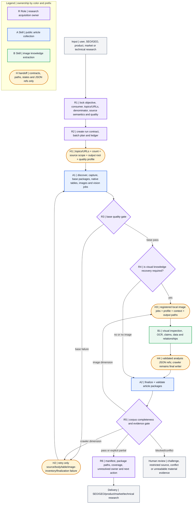
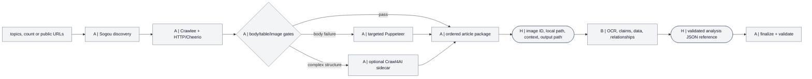
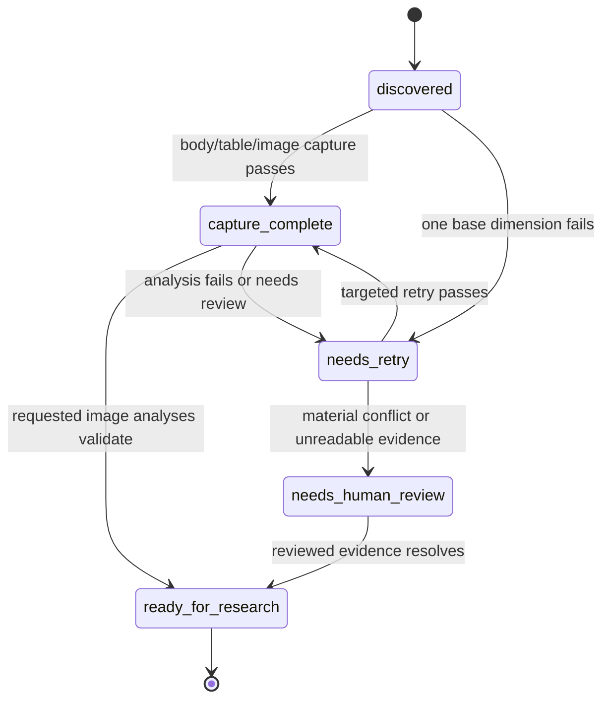

# Architecture and responsibility flows

The system is intentionally three-layered: one accountable Role, one deterministic collection Skill, and one visual-knowledge Skill. Adapter implementations remain inside the crawler Skill.

## Outer Role/A/B workflow

Purple `R` nodes belong to the Role, blue `A` nodes to the crawler, green `B` nodes to image understanding, and orange `H` nodes are explicit handoff contracts.

The raw Mermaid source is [workflow.mmd](../workflows/research-material-acquisition/workflow.mmd); machine-readable ownership is [node-contracts.yaml](../workflows/research-material-acquisition/node-contracts.yaml).

## Atomic crawler/image flow

The detailed ownership figure is maintained in [two-skill-integration-flow.md](../skills/sp-pachong-seo-wenzhang-caiji/references/two-skill-integration-flow.md).

## Why adapters are not separate Skills

HTTP/Cheerio, Crawlee, Puppeteer, and Crawl4AI are implementation routes under one article-package contract. Making each a separate Skill or Role would duplicate quality gates, inflate context, and create competing writers. The outer caller asks for a research outcome; the crawler selects the least costly route that satisfies the same gate.

## Single-writer matrix

| Resource | Sole writer |
|---|---|
| run contract, batch ledger, delivery manifest | Role |
| discovery evidence, article body and ordered blocks | crawler Skill |
| native table JSON/Markdown and layout-table filter counts | crawler Skill |
| image registry, hash-addressed files and vision jobs | crawler Skill |
| per-image analysis JSON | image Skill |
| `article.images[].analysis_ref` and final package status | crawler Skill |
| downstream strategy and synthesis | requesting domain owner |

## State sequence

`ready_for_research` is a package-completeness state, not a fact-veracity label.
