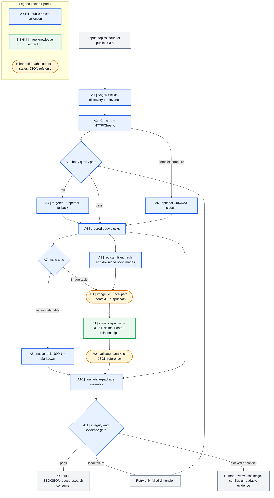

# Two atomic Skills: responsibility-annotated flow

Color and node prefixes both express ownership: blue `A` is article collection, green `B` is image understanding, orange `H` is the handoff contract.

## Single writers

| Artifact | Sole writer |
|---|---|
| discovery, body, native tables, image registry/files | crawler Skill |
| `vision-jobs.json` | crawler Skill |
| `vision/<image_id>.analysis.json` | image Skill |
| `analysis_ref` and final package state | crawler Skill |

The outer Role owns batch contracts and acceptance but never becomes a second artifact writer.
